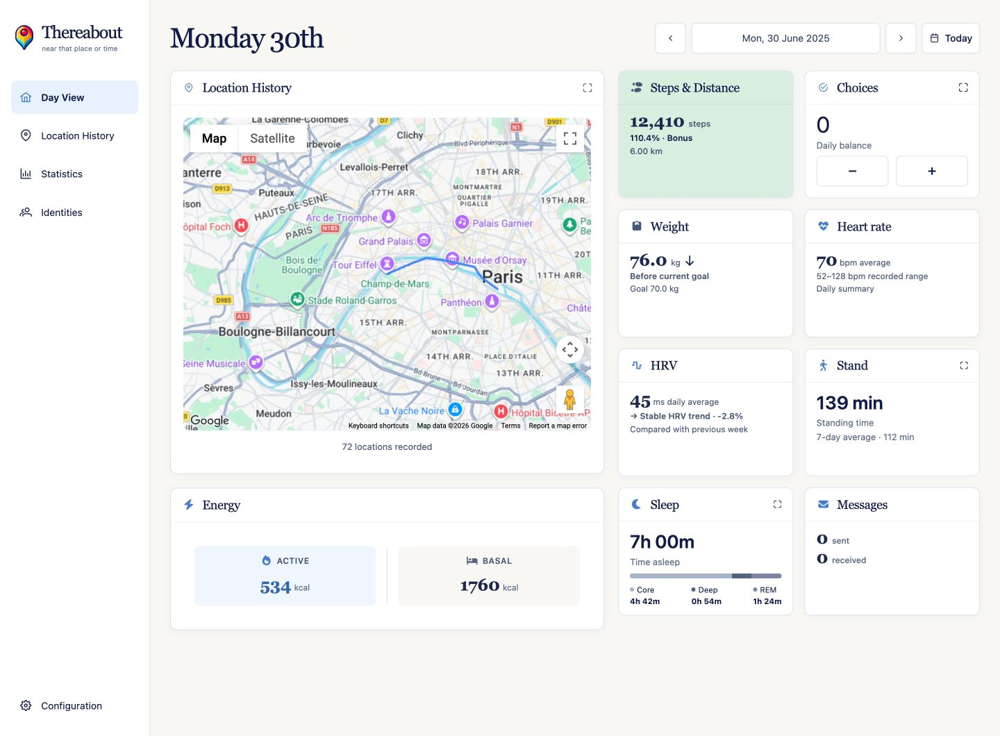
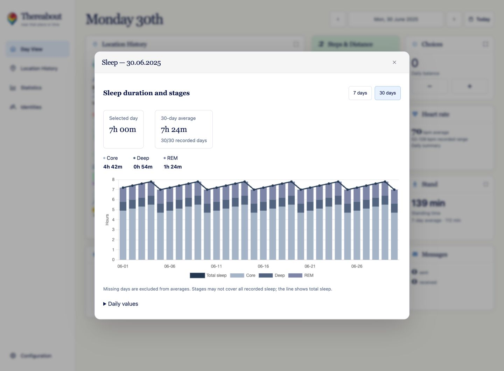
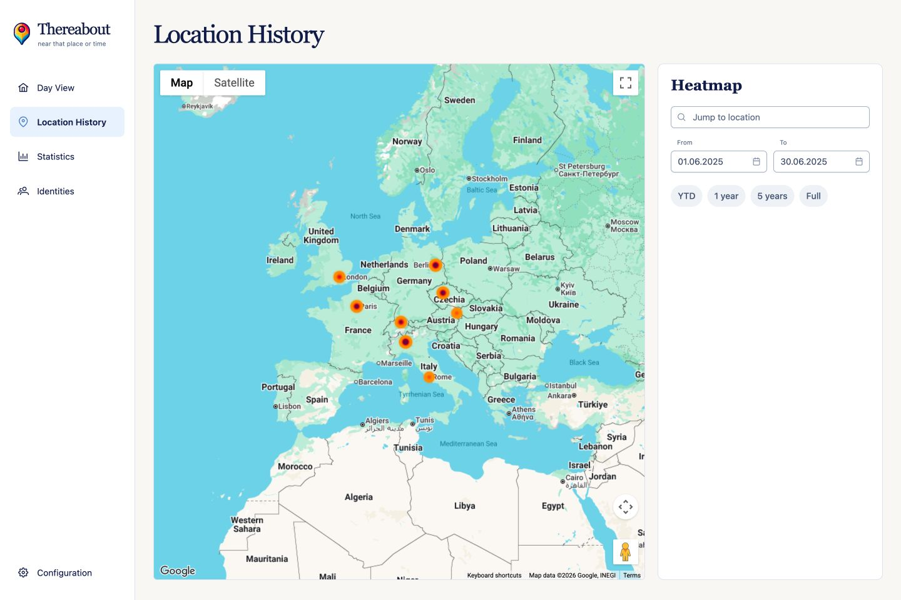
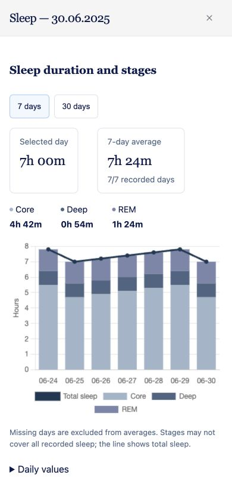

# Thereabout 📍

**Your places, activity and everyday choices, together in one self-hosted timeline.**

Thereabout brings location history, health data and messages into a day-by-day dashboard. Revisit a trip, explore where you spend time, follow your activity and sleep, or keep a simple daily score for the choices you make. Your imported records live in your own MariaDB database.

It started as a web-based alternative to Google Location History and has grown into a personal history dashboard for desktop and mobile.



*Screenshots use synthetic local demo data. Maps are provided by Google Maps.*

## Features

### A dashboard for each day

Pick a date to see your route, activity, health and message totals together. Each detail view stays anchored to that day. Today has a clean `/` URL; other days can be bookmarked with `?date=YYYY-MM-DD`.

| Card | What you can explore |
| --- | --- |
| **Location History** | Daily route, recorded points and an expanded map with a location list. |
| **Energy** | Active and basal energy totals. |
| **Steps & Distance** | Daily steps and walking/running distance, progress against your recent activity baseline, and history charts. |
| **Choices** | A daily score starting at zero: add or subtract a point, go positive or negative, and review 7- or 30-day history. Positive days are green; negative days are red. |
| **Weight** | Recorded weight, trend direction, a configurable weight goal and progress history. |
| **Heart rate** | Daily average and recorded range, with 7- and 30-day history. |
| **HRV** | Daily heart-rate variability, weekly comparisons, personal baseline and history charts. |
| **Stand** | Standing minutes, a 7-day average and 7-/30-day graphs. |
| **Sleep** | Total sleep and Core, Deep and REM stages, with stacked history charts and daily values. Total-only records work too. |
| **Messages** | Sent/received totals and an expandable list of the day's messages. |
| **Workouts** | Imported activities with start time, duration and energy expenditure. |

Health cards use the data you import. Missing sleep stages and missing days remain visibly unavailable rather than becoming invented measurements or zeros. Standing time is measured in minutes, not Apple Watch stand-ring hours.



### Location history and maps

- **Heatmap:** explore a custom date range, year to date, the last year, five years or your full history. Strong heatmap colours and visited-point markers keep less-frequent stops visible.
- **Map controls:** jump to a location, switch between map and satellite imagery, and expand the map.
- **Location editing on desktop:** add points, drag markers, edit timestamps and details, and delete one or several entries.
- **Daily photo shortcut:** open Google Photos search for the selected day.
- **Embeddable map:** display a date-range route with day navigation using `/locationhistory?embed=true&fromDate=YYYY-MM-DD&toDate=YYYY-MM-DD`.
- **Travel statistics:** country count, days abroad, and a country list with first visit, last visit and days spent.



### Messages and identities

- Import WhatsApp chat exports and connect Telegram for message synchronisation.
- Browse messages with pagination, sorting and filters for date, source, sender, receiver and content.
- Manage people and groups, and link their application-specific identities across sources.
- Start, cancel or repeat Telegram history synchronisation from Configuration, and disconnect when needed.

### Desktop and mobile

A collapsible desktop sidebar, mobile bottom navigation, compact cards and full-screen mobile detail views make the same history usable on both screens. A home-screen icon is included. Location creation and marker dragging are desktop interactions.



## Bring your data

| Source | How to add it |
| --- | --- |
| **Google Location History** | Upload an existing `Records.json` export in **Configuration → Data Import**. The importer expects that format; it is not a universal importer for every newer Timeline export. |
| **Overland** | Use **Configure Overland** in Configuration to set up location reporting. |
| **Other location clients** | Submit GeoJSON to `/backend/api/v1/location/geojson`. |
| **Health Auto Export** | Upload its JSON export in Configuration, or submit metrics and workouts to `/backend/api/v1/health`. |
| **WhatsApp** | Upload a chat export as a `.txt` file and select its receiver. |
| **Telegram** | Configure your Telegram API credentials on the server, then connect your account from Configuration. |

Import progress is shown in Configuration. The same page exposes the ingestion API key and application version. See the API schema for request bodies and authentication requirements.

## Self-hosting

> [!IMPORTANT]
> Thereabout has no built-in user login. Protect the entire application with a VPN or an authenticating reverse proxy before making it reachable outside your machine. The ingestion API key does **not** protect the dashboard or every API endpoint. Google Maps remains an external service and requires a Maps API key.

You need Docker Compose and a Google Maps API key suitable for your deployment's hostname.

1. Download [docker-compose.yaml](docker-compose.yaml) into an empty directory.
2. Create a `.env` file alongside it:

   ```dotenv
   GOOGLE_MAPS_API_KEY=replace-with-your-google-maps-key
   THEREABOUT_DATABASE=thereabout
   THEREABOUT_DB_USER=thereabout
   THEREABOUT_DB_PASSWORD=replace-with-a-strong-password
   THEREABOUT_DB_ROOT_PASSWORD=replace-with-a-different-strong-password
   ```

3. Choose an image tag in the Compose file. `latest` is the manually published release channel. `development` receives successful builds from `main` and includes the newest features described here.
4. Start the services:

   ```sh
   docker compose pull
   docker compose up -d
   ```

5. Open [localhost:9050](http://localhost:9050), then visit Configuration to connect your data sources.

The supplied Compose file publishes ports **9050** (web app) and **3306** (MariaDB). For a local-only installation, bind them to `127.0.0.1`; remove the database port mapping if you do not need host access. Apply your chosen access protection before exposing the web port.

Back up the persistent volume and database before upgrading. To update your chosen image channel, run `docker compose pull` followed by `docker compose up -d` again. Database migrations run when the application starts.

### Optional Telegram setup

Add `TELEGRAM_API_ID` and `TELEGRAM_API_HASH` to the `thereabout` service's `environment` mapping, using your own Telegram application credentials. Merely adding them to `.env` does not pass them through the supplied Compose file. Keep `/data` persistent: Telegram's session is stored under `/data/telegram-tdlib`. Then use **Configuration → Telegram sync** to sign in.

## API and development

- **Swagger UI:** [localhost:9050/swagger-ui/index.html](http://localhost:9050/swagger-ui/index.html)
- **OpenAPI definition:** [thereabout.openapi.yaml](backend/src/main/resources/thereabout.openapi.yaml)
- **Stack:** Angular 22, PrimeNG, Chart.js, Google Maps and deck.gl; Spring Boot 4, Java 25 and MariaDB.
- **Frontend tooling:** Node.js 24. From `frontend/`, run `npm ci`, `npm run openapi:generate`, then `npm start`. The development server runs on port 4200 and proxies backend requests to port 9050.
- **Backend tooling:** Maven with Java 25. Run Maven from `backend/`; there is no root Maven reactor. The `development` profile uses local MariaDB. Override its machine-specific import-folder setting with a writable local directory before using imports.

Run checks with a MariaDB instance available and database credentials configured in your environment:

```sh
# From the repository root, with the Compose variables configured:
docker compose -f docker-compose-development.yaml up -d

# Backend unit and integration tests, then packaging:
cd backend
mvn clean install

# Frontend tests and production build:
cd ../frontend
npm ci
npm run openapi:generate
npm test -- --watch=false
npm run build
```

The backend imports more health metric types than the dashboard currently visualises. The API schema is the source of truth for supported payloads; the feature list above describes the implemented UI.
